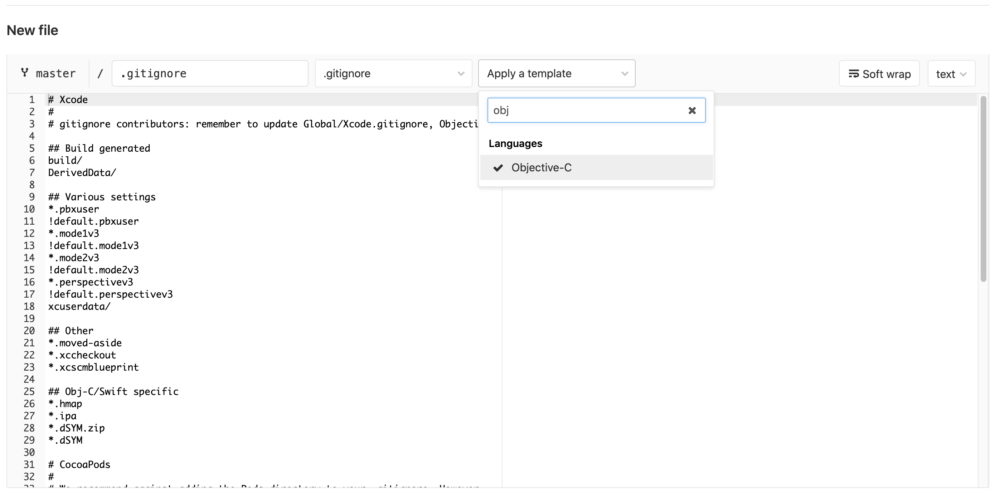

# 2020.Aug.4-git工程体积优化

## **提示：谨慎操作**

**因为操作会改变git历史，笔者全程使用folk出的工程操作，然后将优化完的工程作为替代品使用。**

**请尽量folk工程操作。**

# 1. 起因

          因为工程初始阶段，一些同事上传一些git无法diff的文件（比如mp4、ktx、.xcuserstate）等等，导致工程体积急剧增加，达到了14GB（其中.git 体积12.88GB）。很显然，历史提交中，有很多和代码没有关系又无法被git记录的文件。

# 2. 经过

工欲善其事，必先利其器，我们需要找到需要优化的文件，然后处理掉。

1. **coreutils：coreutils** 中的 **numfmt** 组件可以非常快速地列出文件详情，查找可以优化的文件。
2. **git lfs：**一类是可以转换成为 lfs 文件的，我们需要**git lfs**。
3. **bfg：**一个可以快速优化掉历史文件的工具；后面步骤，Mac Mini 6核6线程的 8500B 会吃满运行一个多小时。

## 2.1 列出文件

1. macOS 已经不自带 numfmt，所以我们需要手动安装。

```ruby
brew install coreutils
```

2. 然后到工程目录下面去列出文件列表

```ruby
git rev-list --objects --all \
| git cat-file --batch-check='%(objecttype) %(objectname) %(objectsize) %(rest)' \
| sed -n 's/^blob //p' \
| sort --numeric-sort --key=2 \
| cut -c 1-12,41- \
| $(command -v gnumfmt || echo numfmt) --field=2 --to=iec-i --suffix=B --padding=7 --round=nearest
```

3. 然后我们可以看到文件排序

```ruby
7e280e9893f2  754KiB iOS/project.xcworkspace/xcuserdata/My.xcuserdatad/UserInterfaceState.xcuserstate
.....
fd61e8cf3d2a  6.2MiB RenderEditor/VideoAssets/movie.mp4
.....
2efc29aa4da9  21MiB iOS/MyEngine/libMySDK.a
e0542215a5f1  27MiB iOS/MySDK/libMyPluginSDK.a 
.....
a3f2f126c95c  447MiB iOS/MyEngine/libMyEngine.a
8244d414133a  447MiB iOS/MyEngine/libMyEngine.a
c40d2c093824  464MiB ShaderLab/libiPhone-lib.a
db46c2e6d13f  539MiB ShaderLab/libiPhone-lib.a
94326d54ef84  589MiB iOS/MySDK/libMyEngine.a
313532f1c875  655MiB iOS/MySDK/libMyEngine.a
92414aa09f04  664MiB iOS/MySDK/libMyEngine.a
06d76cb5bfd4  914MiB iOS/MySDK/libMyEngine.a
```

**静态库文件**：其中，libMyPlugin.a  (~20M)、libMyPluginSDK.a （~20M）都出现了50次以上。是其它同学提供的组件库，没有以代码形式引入；这部分应该用git lfs处理；这里预计可以优化掉本地2GB左右的.git文件夹空间。

**误提交文件**： libMyEngine.a 是以本工程Target命名的，某同学失误将工程build出的带dSYM的debug库直接提交到了git，所以出现几百MB二进制文件的情况；这部分可以选择删除。

**资源文件**：VideoAssets 目录下包含.mp4文件，这部分文件也可以删除。

## 2.2 bfg 删除文件

```ruby
# 使用 git clone --mirror 
git clone --mirror https://g.xx.com/MyEngine/MyXXEngine.git

# 删除＞一定大小的文件
java -jar bfg.jar --strip-blobs-bigger-than 261M

# 删除无用文件和文件夹，这部分操作实际上笔者是在 git lfs 之后
java -jar bfg.jar --delete-files UserInterfaceState.xcuserstate --delete-folders assets --no-blob-protection 

# 后续又补删了 ShaderLab 和 RenderEditor
java -jar bfg.jar --delete-folders  ShaderLab --no-blob-protection 
java -jar bfg.jar --delete-folders  RenderEditor --no-blob-protection 

# 实际上应该可以使用删除多个文件夹的指令
# 笔者当时写成了 java -jar bfg.jar --delete-folders  "RenderEditor,ShaderLab" --no-blob-protection  没有生效，多文件夹写法应该如下，有{}，未尝试。

# bfg --delete-folders "{folderA,folderB,folderC}" 

# 清理
git reflog expire --expire=now --all && git gc --prune=now --aggressive

# push
git push
```

前后对比 

## 2.3 静态库转 git lfs

静态库转lfs，这里建议使用git 官方的 lfs migrate 工具；貌似 bfg 会有问题，[参考链接](https://couto.xyz/posts/git-lfs-migrate-all-branches/](https://couto.xyz/posts/git-lfs-migrate-all-branches/))。

```ruby
git lfs migrate import --include="libMyPlugin.a,libMyPluginSDK.a" --everything
```

# 3. 结果

## 前后对比

[Untitled](https://www.notion.so/a4dbcd635fac4691bc118d1356d9de57)

分析：

**误提交文件**：占了大头，真的太大太大了。

**二进制文件**：约有1.5GB+左右文件可以存到公司git服务器上。

**gitignore文件**：优化了约2GB，日积月累的工程本地配置文件。

**资源文件**：约2GB，不应该上传到git的文件。

# 4. 后记

体积的增加，和开发人员意识和知识掌握程度有着不少联系。规避体积过快膨胀，更重要的是前期做好工作。前期的预防，比后续的优化要简单安全得多。

- **.gitignore**

现在git上添加gitignore文件已经非常方便，不用写一行代码只要一路鼠标点点点就可以生成ignore文件。比如上文提到到资源文件夹，可以使用



- **git lfs**

早一点引入 git lfs，可以让无法git diff的文件存储的云端，不必每次checkout 或者clone将所有二进制文件下载到本地，可以减少本地其它成员的.git目录体积膨胀。

- **Code review**

使用merge request提交代码，每次代码经过review，可以及时发现不应该提交的文件。

# 5. 参考

[https://stackoverflow.com/questions/10622179/how-to-find-identify-large-commits-in-git-history](https://stackoverflow.com/questions/10622179/how-to-find-identify-large-commits-in-git-history)

[https://rtyley.github.io/bfg-repo-cleaner/](https://rtyley.github.io/bfg-repo-cleaner/)

[https://couto.xyz/posts/git-lfs-migrate-all-branches/](https://couto.xyz/posts/git-lfs-migrate-all-branches/)

[https://github.com/git-lfs/git-lfs/issues/326](https://github.com/git-lfs/git-lfs/issues/326)

[https://docs.gitlab.com/ee/topics/git/lfs/migrate_to_git_lfs.html](https://docs.gitlab.com/ee/topics/git/lfs/migrate_to_git_lfs.html)